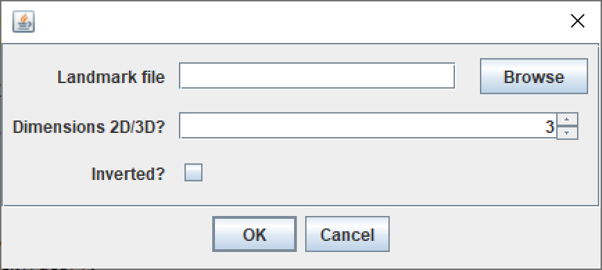

# rCATS_scripts - Estimate Effective Expansion Factor
### Estimate effective expansion factor from BigWarp's landmark file
In order to determine the effective expansion factor from pre- and post-	expansion images or volumes, one needs to identify corresponding points before and after the expansion. From this set a linear map can be estimated, which minimizes the squared error of the points in the pre-expansion image to the ones in the post-expansion image.

### Big Warp
The Fiji plugin *BigWarp* enables to manually annotate corresponding points. Follow the step of [BigWarp](https://imagej.net/plugins/bigwarp) to identify pairs of corresponding points. Use the pre-expansion image as *fixed* image and the post-expansion image as *moving* image. BigWarp allows to preview the transformation. Once the set of corresponding points/ landmarks is complete they need to be saved as .csv file.

### Estimate effective expansion factor custom Fiji script
The Fiji/groovy script [bigwarp_landmark2expansionfactor.groovy](bigwarp_landmark2expansionfactor.groovy) utilizes BigWarp's *SimilarityTransform* implementation to estimate the transformation (as in BigWarp) and extracts the scaling parameter.

#### Inputs:
* path to the landmark .csv file
* dimensionality (2D or 3D inputs)
* direction of mapping

Use *inverted* when you selected the post-expansion as *fixed* image. This will compute the expansion factor of the inverted linear transform.

#### Output:

The effective expansion factor is diplayed after you click OK.

